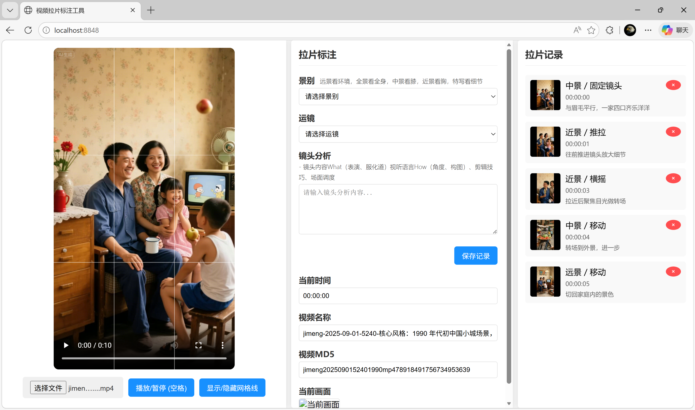

  

  

<h1 align="center">拉片pro</h1>

一个基于 C# 的本地视频拉片标注工具，用结构化方式记录镜头信息、关键帧和分析内容。

  
  
  
  

  
  
  
  

## 项目简介

拉片pro 是一个面向短视频、广告、剧情片和案例素材拆解场景的本地工具。程序启动后会在本地开启轻量服务并打开浏览器页面，支持导入视频、逐镜头记录景别和运镜、填写分析内容、截取关键帧，并按视频维度把结果保存为 JSON 数据。

它更像一个本地化、轻量化、偏实战的拉片工作台，核心目标不是复杂的媒体管理，而是让你更快完成镜头观察、拆解、复盘和沉淀。

## 工作界面

  

左侧视频预览，中间镜头标注区域，右侧拉片记录列表。

## 亮点

- 本地运行，不依赖外部服务，适合个人长期积累拉片资料。
- 导入视频后即可围绕时间点记录景别、运镜和镜头分析。
- 自动抓取当前帧，降低后续整理镜头截图的成本。
- 标注结果按视频维度保存为结构化 JSON，便于二次加工。
- 适合作为个人拉片工具，也适合作为后续扩展导出功能的基础原型。

## 适合谁用

- 做短视频拆解、广告拆片、剧情片学习的人
- 想把镜头观察过程结构化记录下来的人
- 需要沉淀自己的拉片素材库和分析案例的人

## 当前功能

- 本地启动轻量服务，自动打开浏览器页面
- 导入本地视频文件进行逐镜头查看
- 记录景别、运镜和自由文本分析
- 自动显示当前时间点并截取当前帧缩略图
- 按视频唯一标识保存标注记录
- 支持查看、回填和删除已有标注
- 以 JSON 形式落盘，便于后续再处理

## 技术栈

- C#
- .NET Framework 4.8.1
- `HttpListener`
- 原生 HTML / CSS / JavaScript
- `Newtonsoft.Json`

## 运行方式

1. 使用 Visual Studio 2022 打开 `拉片pro.sln`
2. 还原 NuGet 包
3. 以 `Debug` 或 `Release` 方式编译并运行
4. 程序会监听 `http://localhost:8848/`
5. 浏览器打开后，选择本地视频文件即可开始标注

## 数据保存方式

- 标注数据按视频维度保存
- 默认保存为 `case/<video-id>/index.json`
- 每条记录包含景别、运镜、分析内容、时间点、截图和时间戳

说明：
当前前端界面里显示的是 `videoMd5` 字段名，但现阶段实际使用的是基于文件名、大小和修改时间组合生成的本地唯一 ID，并不是真正的 MD5 哈希。

## 后续可继续完善的方向

- 把前端页面移入正式源码目录
- 区分开发数据和示例数据
- 增加导出能力，例如 Markdown / Excel / CSV
- 增加镜头分类维度，例如构图、情绪、声音、转场
- 支持按时间线检索和筛选标注记录
